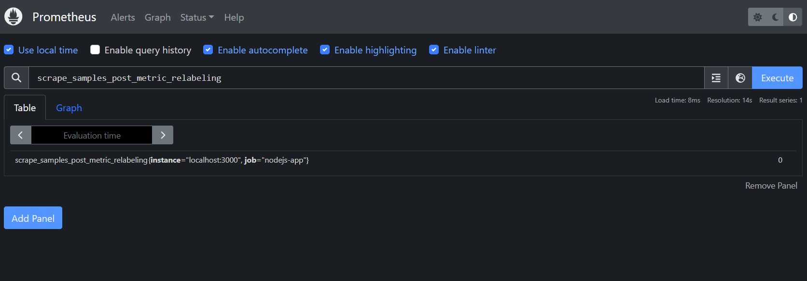

# pro-samlpe
Bài tập lớn môn Các hệ cơ sở dữ liệu.

_Nhóm Kẹt quá kẹt_

## Install
1. Create prometheus.yml file

2. Using Docker command to run prometheus

`docker run -d -p 9090:9090 --name prometheus -v .\prometheus.yml:/etc/prometheus/prometheus.yml prom/prometheus`

### docker run:

Lệnh này được sử dụng để tạo và chạy một container Docker từ một image.
#### -d:

Tùy chọn này chạy container ở chế độ detached (tách rời), có nghĩa là container sẽ chạy ở background và không chiếm dụng terminal.
#### -p 9090:9090:

Tùy chọn này định nghĩa port mapping. Ở đây, port 9090 trên máy chủ (host) sẽ được chuyển tiếp đến port 9090 trong container. Điều này cho phép bạn truy cập Prometheus thông qua http://localhost:9090 trên máy chủ.
#### --name prometheus:

Tùy chọn này đặt tên cho container là prometheus. Điều này giúp bạn dễ dàng quản lý và tham chiếu đến container sau này.
#### -v .\prometheus.yml:/etc/prometheus/prometheus.yml:

Tùy chọn này mount (gắn kết) một tệp hoặc thư mục từ máy chủ vào container. Ở đây, tệp prometheus.yml từ thư mục hiện tại (.) trên máy chủ sẽ được mount vào /etc/prometheus/prometheus.yml trong container. Điều này cho phép Prometheus sử dụng cấu hình được cung cấp từ tệp prometheus.yml trên máy chủ.
#### prom/prometheus:

Đây là tên của image Docker mà bạn muốn chạy. prom/prometheus là image chính thức của Prometheus trên Docker Hub.

3. Cài đặt các dependencies của project

`npm install`

4. Chạy project

`npm run dev`

